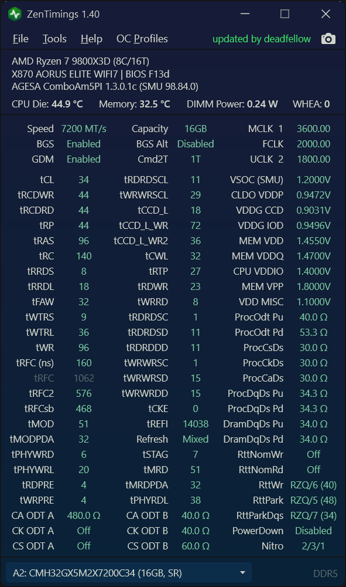

# ZenTimings / Hobby Fork

tCCDL, WR/WR2 Tested on only a handful of systems, so it may not work on every motherboard/CPU, and it won't be actively maintained.

### Projects used  
[Adonis UI (github)](https://benruehl.github.io/adonis-ui/)  
[RTCSharp (github)](https://github.com/tomrus88/RTCSharp)  
[ryzen_smu (gitlab)](https://gitlab.com/leogx9r/ryzen_smu/)  
[ryzen_nb_smu (github)](https://github.com/flygoat/ryzen_nb_smu)  
[zenpower (github)](https://github.com/ocerman/zenpower)  
[Linux kernel (github)](https://github.com/torvalds/linux)  
[AMD's public documentation](https://www.amd.com/en/support/tech-docs)  
[Open Hardware Monitor](https://github.com/openhardwaremonitor/openhardwaremonitor)  

### License

ZenTimings is free software, licensed under the **GNU General Public License v3.0** — see
[LICENSE](LICENSE).

This is a fork of [irusanov/ZenTimings](https://github.com/irusanov/ZenTimings). Hardware access goes
through [ZenStates-Core](https://github.com/irusanov/ZenStates-Core), which is also GPL-3.0 and is
shipped here as a prebuilt, unmodified `Common/ZenStates-Core.dll`.

Bundled third-party components and their licences — all GPL-3.0 compatible — are listed in
[THIRD-PARTY-NOTICES.md](THIRD-PARTY-NOTICES.md), with the full texts in [`licenses/`](licenses/).
